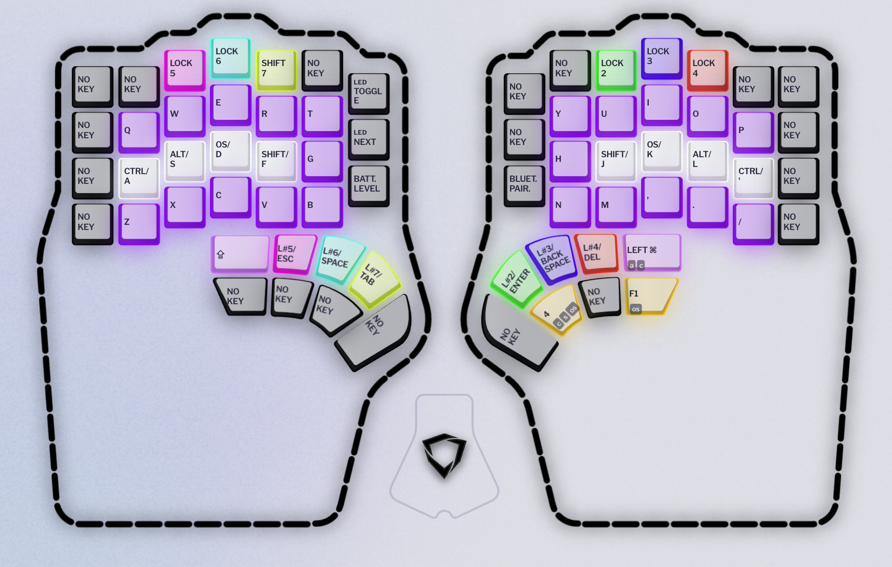
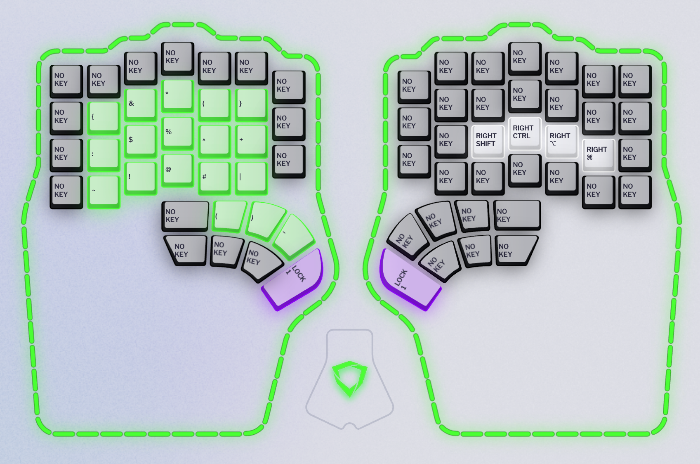
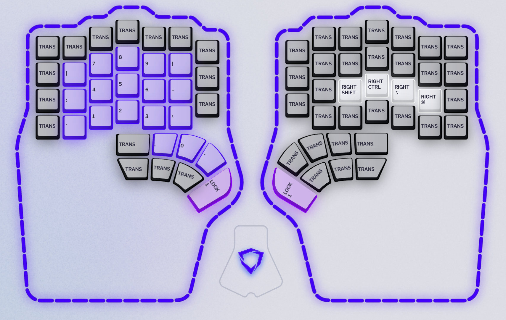
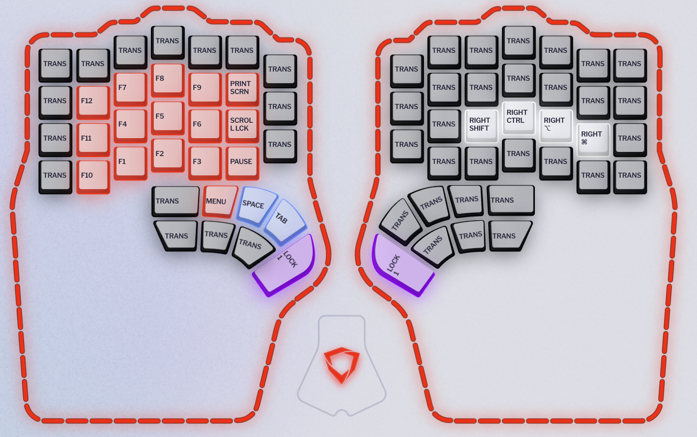
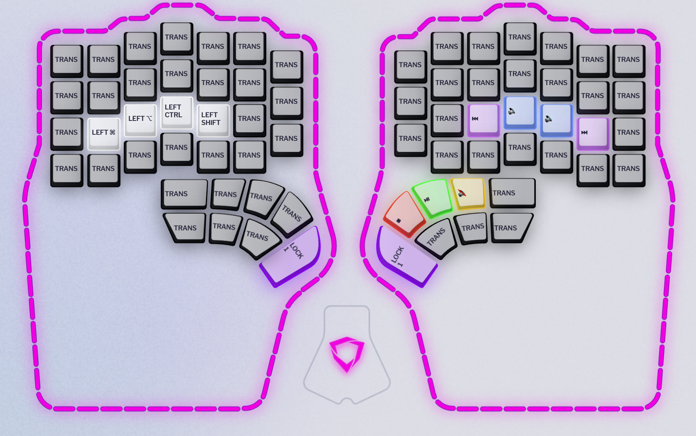
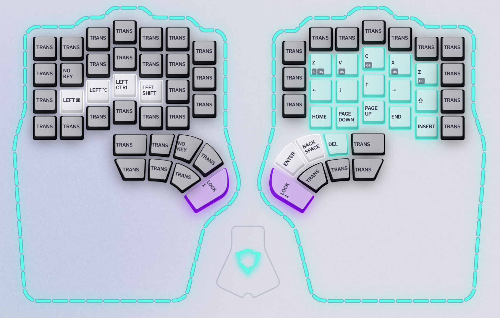
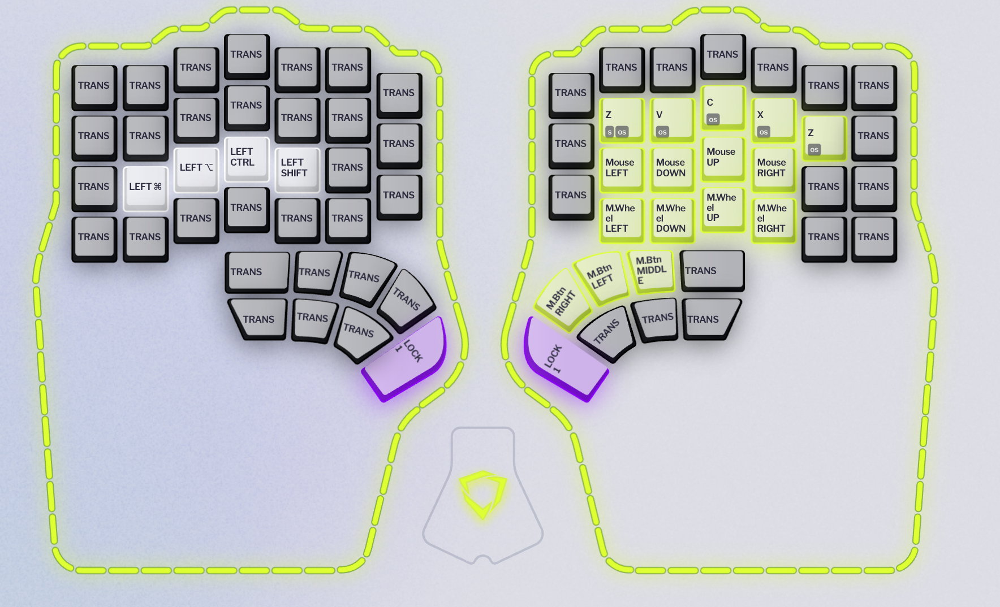
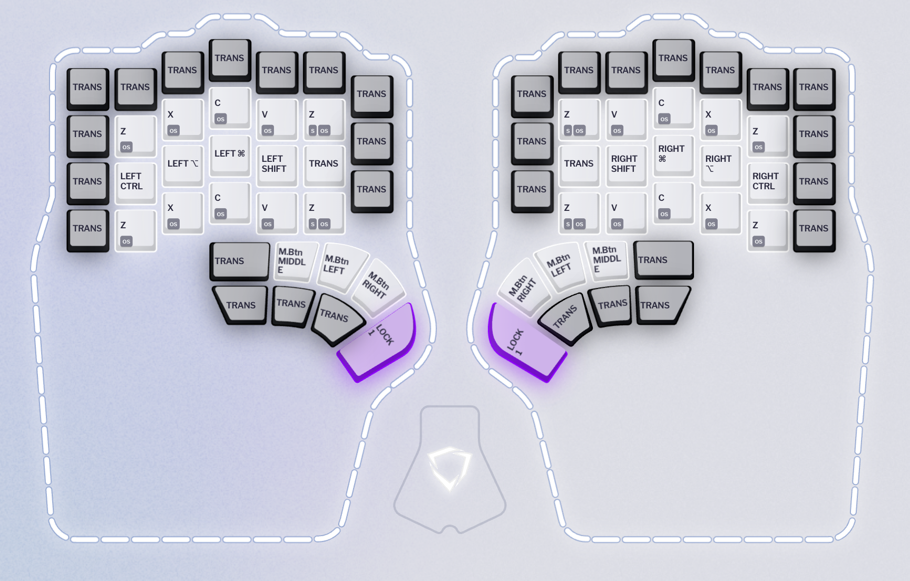

# My Dygma Defy layers

- Basically [Miryoku](https://github.com/manna-harbour/miryoku), with some tweaks
- QWERTY layout

## Layer 1 (Base)

[Base.json](layers/Base.json)

## Layer 2 (Symbol)

[Symbol.json](layers/Symbol.json)

## Layer 3 (Number)

[Number.json](layers/Number.json)

## Layer 4 (Function)

[Function.json](layers/Function.json)

## Layer 5 (Media)

[Media.json](layers/Media.json)

## Layer 6 (Navigation)

[Navigation.json](layers/Navigation.json)

## Layer 7 (Mouse)

[Mouse.json](layers/Mouse.json)

## Layer 7 (Button)

[Button.json](layers/Button.json)

